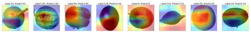

📦 Toy Box] Image Classification
==== 
- This repository implements basic image classficiation using deeplearning.
- You can download the dataset [here](https://www.kaggle.com/moltean/fruits).
- It is connected through the **wandb**. You can check the simple result in [here](https://wandb.ai/vim_hjk/fruit360-image-classification?workspace=user-vim_hjk).
<br></br>
## 🍎 Table of content
- [Getting Start](#GettingStart)<br>
- [CutMix](#CutMix)<br>
- [Grad-CAM](#GradCAM)<br>
- [Results](#Results)<br>
---
## 🍓 Getting Start <a name = 'GettingStart'></a>
### Environment
- pytorch >= 1.6.0
- timm == 0.4.9
- albumentations == 1.0.0
- openc-python == 4.5.2.54
- wandb == 0.10.32
- numpy == 1.20.3
- scikit-learn
- easydict
- pyyaml
- adamp
- pandas
### Dataset
- fruits360 dataset (kaggle)
- [Download link](https://www.kaggle.com/moltean/fruits)
### Directory structure
```
├─checkpoints
├─configs
├─data
├─debug_result
├─eda
├─fruits-360 (download dataset)
│  ├─papers
│  ├─Test
│  ├─test-multiple_fruits
│  ├─Training
├─prediction
├─results
└─src
   ├─lib
   ├─models
   └─utils
```
### Config
- You can set various experimental environments in `configs/config.py`
``` yaml
base:
  seed: 42                            # random seed
  model_arc: 'resnet18d'              # you can use the model provided by timm.
  num_classes: 131
  input_dir: './data/train.csv'       # dataframe generated from eda/labeling.ipynb
  output_dir: './checkpoints/'        # path to save checkpoints
  train_only: False                   # without validation
  cutmix_args:                        # for cutmix augmentation it will be improve to generalized performance
    use_cutmix: True
    beta: 1.0
    cutmix_prob: 0.5
  train_args:                 
    num_epochs: 5                     # number of total epochs
    train_batch_size: 128             # train mini-batch size
    val_batch_size: 128               # validation mini-batch size
    optimizer: 'AdamP'                # optimizer
    max_lr: 0.0001                    # max learning rate for CosineAnnealingLR
    min_lr: 0.00001                   # min learning rate for CosineAnnealingLR
    cycle: 3                          # total cycle
    gamma: 0.5                        # restarts rate
    weight_decay: 0.0001              # weight decay
    scheduler: 'CosineAnnealingLR'    # learning rate scheduler
    loss_fn: 'CrossEntropyLoss'       # loss function
    log_intervals: 10                 # steps for the print log
    eval_metric: 'accuracy'           # evaluation metric
  val_args: 
    use_kfold: False                  # K-Fold Cross Validation
    n_splits: 0                       # number of K (split size)
    test_size: 0.2                    # validation set size

k-fold:
  seed: 42
  model_arc: 'resnet18d'
  num_classes: 131
  input_dir: './data/train.csv'
  output_dir: './checkpoints/'
  train_only: False
  cutmix_args:
    use_cutmix: True
    beta: 1.0
    cutmix_prob: 0.5
  train_args:
    num_epochs: 1
    train_batch_size: 128
    val_batch_size: 128
    optimizer: 'AdamP'
    max_lr: 0.0001
    min_lr: 0.00001
    cycle: 3
    gamma: 0.5
    weight_decay: 0.0001
    scheduler: 'CosineAnnealingLR'
    loss_fn: 'CrossEntropyLoss'
    log_intervals: 10
    eval_metric: 'accuracy'            
  val_args:
    use_kfold: True
    n_splits: 5
    test_size: 0.0
```
### Train
- run `eda/labeling.ipynb`
- `python main.py`
### Evaluation
- `python inference.py`
- `python eval.py`
### Debug (Grad CAM)
- `python debug.py`
---
## 🍍 CutMix <a name = 'CutMix'></a>
- [Paper](https://arxiv.org/abs/1905.04899)
- [Official code](https://github.com/clovaai/CutMix-PyTorch)


---
<br></br>
## 🍊 Grad-CAM <a name = 'GradCAM'></a>
- `python debug.py`
- [Paper](https://arxiv.org/abs/1610.02391)
- [Official code](https://github.com/ramprs/grad-cam)



---
<br></br>
## 🥑 Result <a name = 'Results'></a>
```
                     Accuracy : 0.96602                     
                                                            
                     F1 Score : 0.96460                     
                                                            
'*==================Classificaion Report==================*'
                     precision    recall  f1-score   support
                                                            
     Apple Braeburn       0.95      0.96      0.95       164
 Apple Crimson Snow       0.91      0.99      0.95       148
     Apple Golden 1       1.00      1.00      1.00       160
     Apple Golden 2       1.00      1.00      1.00       164
     Apple Golden 3       0.92      1.00      0.96       161
 Apple Granny Smith       1.00      0.91      0.96       164
    Apple Pink Lady       0.97      1.00      0.98       152
        Apple Red 1       0.84      0.95      0.89       164
        Apple Red 2       0.95      0.95      0.95       164
        Apple Red 3       0.97      1.00      0.98       144
Apple Red Delicious       1.00      1.00      1.00       166
 Apple Red Yellow 1       1.00      0.99      0.99       164
 Apple Red Yellow 2       1.00      1.00      1.00       219
            Apricot       0.95      1.00      0.98       164
            Avocado       0.99      0.99      0.99       143
       Avocado ripe       0.99      1.00      1.00       166
             Banana       0.98      1.00      0.99       166
 Banana Lady Finger       1.00      0.89      0.94       152
         Banana Red       1.00      1.00      1.00       166
           Beetroot       0.88      0.85      0.86       150
          Blueberry       0.96      0.99      0.97       154
       Cactus fruit       1.00      1.00      1.00       166
       Cantaloupe 1       1.00      1.00      1.00       164
       Cantaloupe 2       1.00      1.00      1.00       164
          Carambula       1.00      1.00      1.00       166
        Cauliflower       0.82      1.00      0.90       234
           Cherry 1       1.00      1.00      1.00       164
           Cherry 2       1.00      1.00      1.00       246
     Cherry Rainier       1.00      1.00      1.00       246
   Cherry Wax Black       1.00      1.00      1.00       164
     Cherry Wax Red       1.00      1.00      1.00       164
  Cherry Wax Yellow       1.00      1.00      1.00       164
           Chestnut       0.94      0.97      0.95       153
         Clementine       1.00      1.00      1.00       166
              Cocos       1.00      0.99      1.00       166
               Corn       1.00      0.42      0.59       150
          Corn Husk       0.88      0.66      0.75       154
      Cucumber Ripe       1.00      0.92      0.96       130
    Cucumber Ripe 2       1.00      0.90      0.95       156
              Dates       0.99      1.00      0.99       166
           Eggplant       1.00      0.80      0.89       156
                Fig       1.00      1.00      1.00       234
        Ginger Root       0.88      1.00      0.94        99
         Granadilla       1.00      1.00      1.00       166
         Grape Blue       0.98      1.00      0.99       328
         Grape Pink       0.95      1.00      0.98       164
        Grape White       1.00      1.00      1.00       166
      Grape White 2       1.00      1.00      1.00       166
      Grape White 3       1.00      0.89      0.94       164
      Grape White 4       0.90      1.00      0.95       158
    Grapefruit Pink       1.00      1.00      1.00       166
   Grapefruit White       1.00      1.00      1.00       164
              Guava       0.90      1.00      0.95       166
           Hazelnut       1.00      1.00      1.00       157
        Huckleberry       1.00      1.00      1.00       166
               Kaki       1.00      1.00      1.00       166
               Kiwi       1.00      1.00      1.00       156
           Kohlrabi       0.83      1.00      0.90       157
           Kumquats       1.00      1.00      1.00       166
              Lemon       0.97      1.00      0.98       164
        Lemon Meyer       1.00      1.00      1.00       166
              Limes       0.99      1.00      1.00       166
             Lychee       1.00      1.00      1.00       166
          Mandarine       1.00      1.00      1.00       166
              Mango       1.00      1.00      1.00       166
          Mango Red       0.96      0.94      0.95       142
          Mangostan       1.00      1.00      1.00       102
           Maracuja       0.90      1.00      0.95       166
 Melon Piel de Sapo       1.00      1.00      1.00       246
           Mulberry       1.00      1.00      1.00       164
          Nectarine       0.75      1.00      0.85       164
     Nectarine Flat       0.98      0.93      0.96       160
         Nut Forest       0.98      0.98      0.98       218
          Nut Pecan       0.96      0.99      0.98       178
          Onion Red       1.00      1.00      1.00       150
   Onion Red Peeled       0.99      1.00      1.00       155
        Onion White       0.99      1.00      0.99       146
             Orange       1.00      1.00      1.00       160
             Papaya       1.00      1.00      1.00       164
      Passion Fruit       0.96      0.95      0.95       166
              Peach       1.00      0.66      0.79       164
            Peach 2       1.00      1.00      1.00       246
         Peach Flat       0.91      1.00      0.95       164
               Pear       0.99      1.00      1.00       164
             Pear 2       1.00      0.56      0.71       232
         Pear Abate       1.00      1.00      1.00       166
       Pear Forelle       0.69      1.00      0.82       234
        Pear Kaiser       1.00      1.00      1.00       102
       Pear Monster       1.00      0.99      1.00       166
           Pear Red       1.00      1.00      1.00       222
         Pear Stone       0.91      1.00      0.95       237
      Pear Williams       1.00      1.00      1.00       166
             Pepino       1.00      0.79      0.88       166
       Pepper Green       1.00      1.00      1.00       148
      Pepper Orange       1.00      1.00      1.00       234
         Pepper Red       0.74      0.92      0.82       222
      Pepper Yellow       1.00      1.00      1.00       222
           Physalis       1.00      1.00      1.00       164
 Physalis with Husk       0.90      1.00      0.95       164
          Pineapple       0.99      1.00      1.00       166
     Pineapple Mini       1.00      1.00      1.00       163
       Pitahaya Red       1.00      1.00      1.00       166
               Plum       0.99      1.00      0.99       151
             Plum 2       0.99      1.00      0.99       142
             Plum 3       1.00      1.00      1.00       304
        Pomegranate       0.93      0.80      0.86       164
     Pomelo Sweetie       1.00      1.00      1.00       153
         Potato Red       1.00      0.69      0.81       150
  Potato Red Washed       1.00      0.95      0.98       151
       Potato Sweet       0.93      0.63      0.75       150
       Potato White       0.79      1.00      0.88       150
             Quince       1.00      1.00      1.00       166
           Rambutan       1.00      1.00      1.00       164
          Raspberry       0.99      1.00      1.00       166
         Redcurrant       1.00      1.00      1.00       164
              Salak       0.93      1.00      0.96       162
         Strawberry       1.00      1.00      1.00       164
   Strawberry Wedge       1.00      1.00      1.00       246
          Tamarillo       0.99      1.00      0.99       166
            Tangelo       1.00      1.00      1.00       166
           Tomato 1       1.00      0.99      0.99       246
           Tomato 2       1.00      1.00      1.00       225
           Tomato 3       0.92      1.00      0.96       246
           Tomato 4       1.00      1.00      1.00       160
  Tomato Cherry Red       1.00      1.00      1.00       164
       Tomato Heart       1.00      0.69      0.82       228
      Tomato Maroon       1.00      1.00      1.00       127
      Tomato Yellow       1.00      1.00      1.00       153
 Tomato not Ripened       1.00      1.00      1.00       158
             Walnut       0.92      1.00      0.96       249
         Watermelon       0.98      1.00      0.99       157
                                                            
           accuracy                           0.97     22688
          macro avg       0.97      0.97      0.96     22688
       weighted avg       0.97      0.97      0.96     22688
```
